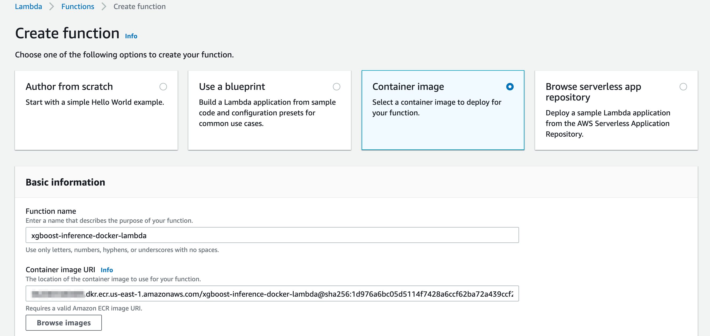
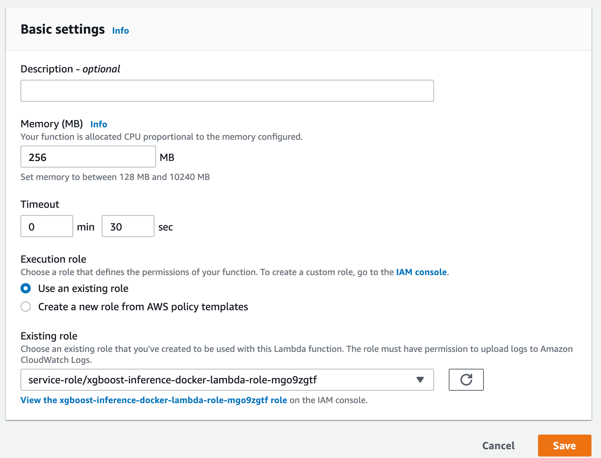

## Pay as you go machine learning inference with AWS Lambda (Docker images)

This repo contains resources to help you deploy a Lambda function based on Python Container Image. 
The applications illustrate how to perform inference with breast cancer XGBoost ML model.

## Building the Lambda Function Docker image, testing locally, and pushing to Amazon ECR registry
In the next steps you'll build the Docker image, and optionally test it on your machine. 
Next, you'll tag the Docker image and push it to [Amazon ECR Repository](https://docs.aws.amazon.com/AmazonECR/latest/userguide/Repositories.html).

### Create an image from an AWS base image for Lambda
Build your Docker image with the `docker build` command. Enter a name for the image. The following example names the image xgboost-inference-docker-lambda.

`docker build -t xgboost-inference-docker-lambda .`  

### (Optional) Test your application locally using the [runtime interface emulator](https://docs.aws.amazon.com/lambda/latest/dg/images-test.html)

Run your container image locally using the docker run command

`docker run -p 9000:8080 xgboost-inference-docker-lambda:latest `

From a new terminal window, post an event to the following endpoint using a curl command:

```bash
curl --location --request POST 'http://localhost:9000/2015-03-31/functions/function/invocations' \
--header 'Content-Type: application/json' \
--data-raw '{
  "radius_mean": 13.49,
  "texture_mean": 22.3,
  "perimeter_mean": 86.91,
  "area_mean": 561,
  "smoothness_mean": 0.08752,
  "compactness_mean": 0.07697999999999999,
  "concavity_mean": 0.047510000000000004,
  "concave points_mean": 0.033839999999999995,
  "symmetry_mean": 0.1809,
  "fractal_dimension_mean": 0.057179999999999995,
  "radius_se": 0.2338,
  "texture_se": 1.3530000000000002,
  "perimeter_se": 1.735,
  "area_se": 20.2,
  "smoothness_se": 0.004455,
  "compactness_se": 0.013819999999999999,
  "concavity_se": 0.02095,
  "concave points_se": 0.01184,
  "symmetry_se": 0.01641,
  "fractal_dimension_se": 0.001956,
  "radius_worst": 15.15,
  "texture_worst": 31.82,
  "perimeter_worst": 99,
  "area_worst": 698.8,
  "smoothness_worst": 0.1162,
  "compactness_worst": 0.1711,
  "concavity_worst": 0.2282,
  "concave points_worst": 0.1282,
  "symmetry_worst": 0.2871,
  "fractal_dimension_worst": 0.06917000000000001
}'
```

This command invokes the function running in the container image and returns a response.

You should get a response as follows: `"{\"result\": \"B\"}"`

### Create an Amazon ECR Repository

`aws ecr create-repository --repository-name xgboost-inference-docker-lambda`

### Authenticate the Docker CLI to your Amazon ECR registry

Replace `<YOUR AWS ACCOUNT ID>` with your AWS account id

`aws ecr get-login-password --region us-east-1 | docker login --username AWS --password-stdin <YOUR AWS ACCOUNT ID>.dkr.ecr.us-east-1.amazonaws.com    
`

### Tag your image to match your repository name, and deploy the image to Amazon ECR using the docker push command

Replace `<YOUR AWS ACCOUNT ID>` with your AWS account id

`docker tag  xgboost-inference-docker-lambda:latest <YOUR AWS ACCOUNT ID>.dkr.ecr.us-east-1.amazonaws.com/xgboost-inference-docker-lambda:latest`

`docker push <YOUR AWS ACCOUNT ID>.dkr.ecr.us-east-1.amazonaws.com/xgboost-inference-docker-lambda:latest`

## Creating the Lambda Function in AWS Console

In the next steps, you'll create the Lambda function in AWS console, using the container image built previously. 

### Create Function

1. Browse to the [Lambda console](https://console.aws.amazon.com/lambda)
2. Choose _Create function_
3. On the next page, choose _Container image_ 
4. For Function name, use _xgboost-inference-docker-lambda_
5. For Container image URI, choose the _Browse images_, and choose the container image you pushed to ECR previously
6. Choose _Create function_



Wait for the function to be created.

### Modify Lambda memory and time out
Since the Lambda will load an XGBoost model and use it for inference you'll need to increase the time out and allocate more memory.

1. On the Basic settings section, choose _Edit_
2. For Memory (MB), choose 256 MB
3. For Timeout, choose 30 sec
4. Choose Save

